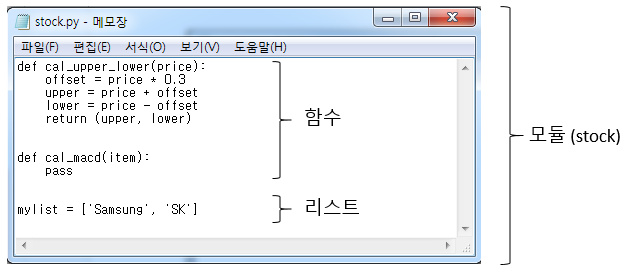
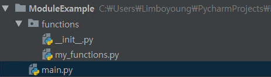
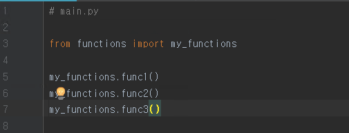
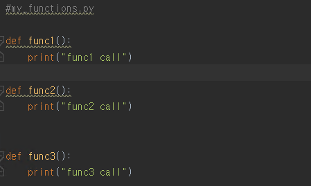

# Module
### 프로그램의 기능 단위, 즉 파일 단위로 작성된 파이썬 코드를 의미함
> 아래 그림 예시에서, stock.py 파일은 두 개의 함수 (cal_upper_lower, cal_macd)와 리스트 (mylist)로 구성
1. 이 파일은 함수와 리스트를 포함하며, 이름이 stock이므로 파이썬에서는 이 파일을 stock 모듈이라 부름
2. 일반적인 워드 파일에서 .docx 확장자가 붙는 것 처럼, 보통 파이썬 코드는 .py 확장자 사용
3. 모듈은 함수보다 상위 개념

### 파이썬에서 모듈을 사용하는 이유?
> 코드 재사용을 위해서 사용

### 모듈 사용하는 방법
> 함수가 정의되어 있는 파일 자체를 복사한 후, 모듈을 import 하기만 하면 해당 파일(모듈)에 구현된 모든 함수 및 자료구조 사용 가능

### 모듈 사용 예시 코드

{: width="200" height="200"}{: .left}
{: width="200" height="200"}{: .left}
